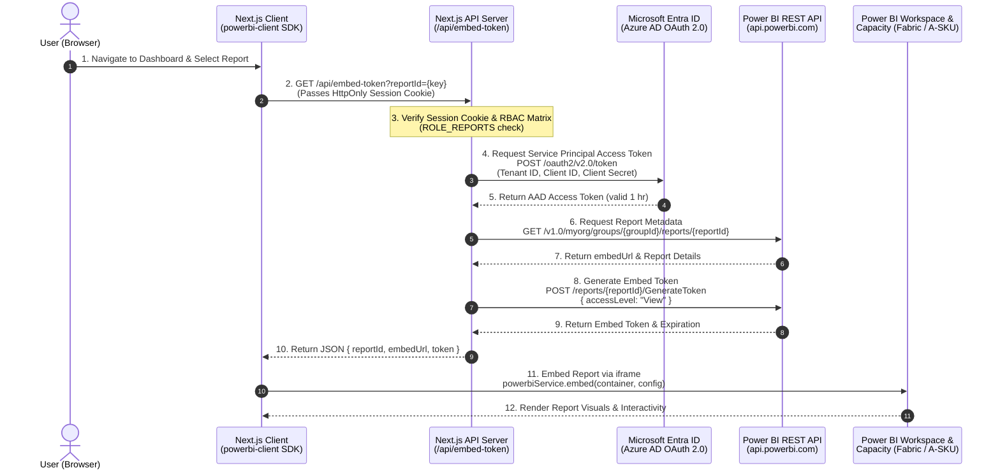

# Architecture & Power BI Integration Specification

**Date:** September 15, 2026  
**Project:** Manomay Analytics Portal  
**Document Version:** 1.0.0  
**Target Audience:** IT Team, System Administrators, DevOps & Cloud Engineers

---

## 1. Executive Summary

This document outlines the system architecture for the **Manomay Analytics Portal**, specifically detailing how Power BI reports are embedded into the Next.js application using the **"App Owns Data" (Service Principal)** embedding model.

It also provides the technical justification and setup guidelines for the IT team to configure Microsoft Entra ID (Azure AD), Power BI Tenant permissions, and **Microsoft Fabric / Azure Power BI Embedded Capacity** to remove trial banners and enable production-grade embedding.

---

## 2. High-Level Architecture Diagram



---

## 3. System Architecture & Component Breakdown

```
┌────────────────────────────────────────────────────────────────────────────────────────┐
│                                     CLIENT LAYER                                       │
│  User Browser                                                                          │
│   ├── Next.js 14+ React Client Components (src/components/ReportViewer.tsx)            │
│   └── powerbi-client JS SDK (Dynamic Import, HTML5 iframe container)                    │
└─────────────────────────────────────────┬──────────────────────────────────────────────┘
                                          │ HTTP / API Requests (Session Cookie)
                                          ▼
┌────────────────────────────────────────────────────────────────────────────────────────┐
│                                APPLICATION SERVER LAYER                                │
│  Next.js App Router (Node.js Runtime)                                                  │
│   ├── Session & Auth Verification: src/lib/auth/session.ts                              │
│   ├── RBAC Permission Engine: src/lib/auth/access.ts & .env (ROLE_REPORTS)             │
│   ├── Embed API Endpoint: src/app/api/embed-token/route.ts                             │
│   ├── AAD Token Cache Manager: src/lib/powerbi/aad.ts                                  │
│   └── Power BI API Integration: src/lib/powerbi/embedToken.ts                          │
└──────────────────┬──────────────────────────────────────────────────────┬──────────────┘
                   │                                                      │
                   │ Client Credentials OAuth 2.0                          │ Power BI REST API Calls
                   ▼                                                      ▼
┌────────────────────────────────────────┐  ┌───────────────────────────────────────────┐
│     MICROSOFT ENTRA ID (AZURE AD)      │  │             POWER BI SERVICE              │
│  Tenant: 498d20b8-3f6d-4195-...        │  │  Workspace ID: 73d95843-9473-4315-...    │
│  App Registration (Service Principal): │  │  ├── Report 1: Resource Utilization       │
│  Client ID: 0e9d9c61-2cb7-48f0-...     │  │  ├── Report 2: Revenue & Target Tracking  │
│  Secret: e8u8Q~5eVZK4AzZaps...         │  │  ├── Report 3: Timesheets & Invoice       │
│                                        │  │  ├── Report 4: Contracts & Agreements   │
│  Permissions:                          │  │  ├── Report 5: Status Updates             │
│  - PowerBI.Read.All                    │  │  ├── Report 6: Resource Util (No Cost)   │
│  - Service Principal API Access        │  │  └── Report 7: Project Budget Tracking    │
└────────────────────────────────────────┘  └─────────────────────┬─────────────────────┘
                                                                  │
                                                                  │ Backed By Capacity
                                                                  ▼
                                            ┌───────────────────────────────────────────┐
                                            │     CAPACITY LAYER (IT Action Required)    │
                                            │  Microsoft Fabric Capacity (F2 SKU) OR    │
                                            │  Azure Power BI Embedded (A1 SKU)         │
                                            │  * Removes Trial Banner                   │
                                            │  * Unlocks Unlimited Production Embedding │
                                            └───────────────────────────────────────────┘
```

---

## 4. Power BI Capacity Requirement for IT Team

### The Issue

When running the application, reports currently display the following banner:

> **"This is a free trial version to remove this label a capacity must be purchased"**

### Why Power BI Pro License Is Not Sufficient

- **Power BI Pro** is a user-specific license meant for direct logins to `app.powerbi.com` or _"User Owns Data"_ embedding (where every single app user authenticates with an individual Azure AD account).
- The application uses **Service Principal embedding ("App Owns Data")**, which relies on programmatic tokens (`GenerateToken` API). Microsoft requires a dedicated **Capacity** linked to the workspace to serve embed tokens in production without trial banners or rate limits.

### Recommended IT Action Plan

#### Step 1: Provision Capacity in Azure Portal

The IT team should provision one of the following capacity options depending on organization budget:

| Option                     | SKU                                | Approx. Cost                | Notes / Advantages                                                                      |
| :------------------------- | :--------------------------------- | :-------------------------- | :-------------------------------------------------------------------------------------- |
| **Option A (Recommended)** | **Microsoft Fabric Capacity (F2)** | ~\$0.36 / hour (~\$260/mo)  | Modern Microsoft standard. **Can be paused/resumed** via Azure script during off-hours. |
| **Option B**               | **Azure Power BI Embedded (A1)**   | ~\$1.008 / hour (~\$735/mo) | Dedicated Power BI Embedded SKU. Also pauseable via Azure Portal.                       |

#### Step 2: Assign Capacity to the Workspace

1. Go to [Power BI Service](https://app.powerbi.com) $\rightarrow$ Workspaces.
2. Select Workspace: `73d95843-9473-4315-98d2-cb9923939fda` (Manomay Analytics Workspace).
3. Open **Workspace settings** $\rightarrow$ **Premium / Capacity** tab.
4. Toggle **Capacity** to **ON**.
5. Select the provisioned **Fabric Capacity (F2)** or **Power BI Embedded (A1)**.
6. Click **Save**.

_Result: The banner will be removed immediately across all embedded reports for all users._

---

## 5. Active Environment Configuration Reference

Below are the active environment variables configured in `.env`:

```env
# Azure AD & Service Principal
PBI_TENANT_ID="<TENANT_ID>"
PBI_CLIENT_ID="<CLIENT_ID>"
PBI_CLIENT_SECRET="<CLIENT_SECRET>"

# Power BI Workspace
PBI_WORKSPACE_ID="<WORKSPACE_ID>"

# Report GUIDs
PBI_REPORT_ID_RESOURCE_UTILIZATION="<ID_ADDED>"
PBI_REPORT_ID_REVENUE_TRACKING="<ID_ADDED>"
PBI_REPORT_ID_TIMESHEETS_TRACKING="<ID_ADDED>"
PBI_REPORT_ID_CONTRACTS_TRACKING="<ID_ADDED>"
PBI_REPORT_ID_STATUS_UPDATES="<ID_ADDED>"
PBI_REPORT_ID_RESOURCE_UTILIZATION_WITHOUT_COST="<ID_ADDED>"
PBI_REPORT_ID_PROJECT_BUDGET_TRACKING="<ID_ADDED>"
```

---

## 6. IT Checklist for Tenant & Service Principal Setup

- [x] **Service Principal Created:** App Registration `0e9d9c61-2cb7-48f0-8970-8109d42055e6` created in Entra ID.
- [x] **Power BI Tenant Admin Setting:** Enable _"Allow service principals to use Power BI APIs"_ in Power BI Admin Portal.
- [x] **Workspace Access:** Service Principal added as **Member** or **Admin** access in Power BI Workspace `73d95843-9473-4315-98d2-cb9923939fda`.
- [ ] **Capacity Assignment (Pending IT):** Assign F2 or A1 Capacity to workspace to remove free trial banner.
