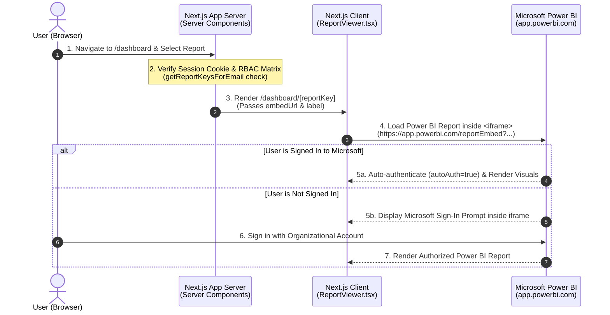

# Architecture & Power BI Integration Specification

**Date:** September 18, 2026  
**Project:** Manomay Analytics Portal  
**Document Version:** 2.0.0  
**Target Audience:** IT Team, System Administrators, DevOps & Cloud Engineers

---

## 1. Executive Summary

This document outlines the updated system architecture for the **Manomay Analytics Portal**, detailing how Power BI reports are embedded into the Next.js application using **Direct Organizational Embedding (Direct Iframe with User Authentication)**.

In Document Version 2.0.0, the backend Microsoft Service Principal token minting architecture (`PBI_CLIENT_SECRET`, `PBI_CLIENT_ID`, `PBI_TENANT_ID`, `/api/embed-token`, `powerbi-client` JS SDK, and `aad.ts`/`embedToken.ts`) has been **completely removed**. 

Reports are now embedded directly in the application using standard Power BI organizational embed URLs (`PBI_REPORT_URL_*`) inside an HTML5 `<iframe>` container with `autoAuth=true`. Users authenticate directly using their own Microsoft 365 / Power BI accounts in the browser, eliminating trial banners and Service Principal capacity dependencies while keeping the codebase lightweight and secure.

---

## 2. High-Level Architecture Diagram



---

## 3. System Architecture & Component Breakdown

```
┌────────────────────────────────────────────────────────────────────────────────────────┐
│                                     CLIENT LAYER                                       │
│  User Browser                                                                          │
│   ├── Next.js 16+ React Client Component (src/components/ReportViewer.tsx)              │
│   └── Clean HTML5 Iframe Container (Full-screen toggle, responsive viewport)           │
└─────────────────────────────────────────┬──────────────────────────────────────────────┘
                                          │ HTTP / Navigation (Session Cookie)
                                          ▼
┌────────────────────────────────────────────────────────────────────────────────────────┐
│                                APPLICATION SERVER LAYER                                │
│  Next.js App Router (Server-side Gating & RBAC)                                        │
│   ├── Session Verification: src/lib/auth/session.ts                                    │
│   ├── RBAC Permission Engine: src/lib/auth/access.ts & .env (ROLE_REPORTS)             │
│   └── Report Config & URL Resolver: src/lib/powerbi/config.ts                          │
└─────────────────────────────────────────┬──────────────────────────────────────────────┘
                                          │ Direct Iframe Embed URL (PBI_REPORT_URL_*)
                                          ▼
┌────────────────────────────────────────────────────────────────────────────────────────┐
│                                MICROSOFT POWER BI SERVICE                              │
│  Power BI Workspace (app.powerbi.com)                                                  │
│   ├── Resource Utilization                                                             │
│   ├── Resource Utilization (Without Cost)                                              │
│   ├── Revenue & Target Tracking                                                        │
│   ├── Timesheets & Invoice Tracking                                                    │
│   ├── Contracts & Agreements Tracking                                                  │
│   ├── Status Updates                                                                   │
│   └── Project Budget Tracking                                                          │
│  * Authenticates user via Microsoft 365 SSO (autoAuth=true)                            │
└────────────────────────────────────────────────────────────────────────────────────────┘
```

---

## 4. Key Architectural Changes in

### What Was Removed:
- **Service Principal Credentials:** `PBI_CLIENT_SECRET`, `PBI_CLIENT_ID`, `PBI_TENANT_ID`, and `PBI_WORKSPACE_ID` environment variables.
- **Backend Token Minting APIs:** `src/app/api/embed-token/route.ts` and `src/app/api/powerbi-test/route.ts`.
- **Azure AD Token Utilities:** `src/lib/powerbi/aad.ts` and `src/lib/powerbi/embedToken.ts`.
- **Client SDK Dependency:** `powerbi-client` npm package.

### Why This Design:
1. **Simplified Security Model:** No client secrets stored on application servers. Security relies on the user's Microsoft 365 account credentials and workspace permissions.
2. **No Capacity / Trial Banners:** Standard organizational report embedding does not trigger Service Principal trial capacity limitations or trial banners.
3. **Zero Maintenance Overhead:** No token generation failures, token expiration logic, or Service Principal secret rotations to manage.

---

## 5. Environment Configuration Reference

Active environment configuration in `.env`:

```env
# Company Branding
NEXT_PUBLIC_COMPANY_NAME="Manomay Analytics"

# USERS & ROLE_REPORTS (RBAC)
USERS="email:password:role,..."
ROLE_REPORTS="admin:[key1:key2...],viewer:[key...]"

# ==============================================================================
# POWER BI REPORT DIRECT EMBED URLS
# ==============================================================================

# Report URL: Resource Utilization
PBI_REPORT_URL_RESOURCE_UTILIZATION="https://app.powerbi.com/reportEmbed?reportId=ee08367f-ce29-46b2-aec3-897504412ae0&autoAuth=true&groupId=73d95843-9473-4315-98d2-cb9923939fda&ctid=498d20b8-3f6d-4195-ab21-c4f8091a3624"

# Report URL: Resource Utilization (Without Cost)
PBI_REPORT_URL_RESOURCE_UTILIZATION_WITHOUT_COST="https://app.powerbi.com/reportEmbed?reportId=cc19b427-b7c9-43ba-a90f-0a509c2e86c5&autoAuth=true&groupId=73d95843-9473-4315-98d2-cb9923939fda&ctid=498d20b8-3f6d-4195-ab21-c4f8091a3624"

# Report URL: Revenue Tracking
PBI_REPORT_URL_REVENUE_TRACKING="https://app.powerbi.com/reportEmbed?reportId=df540fc1-0497-49d4-abed-d3a5ebba32a7&autoAuth=true&groupId=73d95843-9473-4315-98d2-cb9923939fda&ctid=498d20b8-3f6d-4195-ab21-c4f8091a3624"

# Report URL: Timesheets Tracking
PBI_REPORT_URL_TIMESHEETS_TRACKING="https://app.powerbi.com/reportEmbed?reportId=368fb7b3-8763-48f3-917b-41e186d2e519&autoAuth=true&groupId=73d95843-9473-4315-98d2-cb9923939fda&ctid=498d20b8-3f6d-4195-ab21-c4f8091a3624"

# Report URL: Contracts Tracking
PBI_REPORT_URL_CONTRACTS_TRACKING="https://app.powerbi.com/reportEmbed?reportId=e0f83a78-dcb0-4c08-9f42-84322c847d13&autoAuth=true&groupId=73d95843-9473-4315-98d2-cb9923939fda&ctid=498d20b8-3f6d-4195-ab21-c4f8091a3624"

# Report URL: Status Updates
PBI_REPORT_URL_STATUS_UPDATES="https://app.powerbi.com/reportEmbed?reportId=c7edb795-cea6-48e7-83b2-6692184a0cda&autoAuth=true&groupId=73d95843-9473-4315-98d2-cb9923939fda&ctid=498d20b8-3f6d-4195-ab21-c4f8091a3624"

# Report URL: Project Budget Tracking
PBI_REPORT_URL_PROJECT_BUDGET_TRACKING="https://app.powerbi.com/reportEmbed?reportId=6319278b-a05b-4da9-b9aa-fdc91d9b4d72&autoAuth=true&groupId=73d95843-9473-4315-98d2-cb9923939fda&ctid=498d20b8-3f6d-4195-ab21-c4f8091a3624"
```

---

## 6. Implementation Checklist

- [x] **Direct Iframe Integration:** Updated `ReportViewer.tsx` to render iframe views with full-screen support.
- [x] **Service Principal Cleanup:** Removed `aad.ts`, `embedToken.ts`, `/api/embed-token`, and `powerbi-client` SDK.
- [x] **Direct Report URLs:** Configured direct organizational URLs in `.env` and `.env.example`.
- [x] **Role-Based Access Control (RBAC):** Server-side route gating enforced via `getReportKeysForEmail` check.
