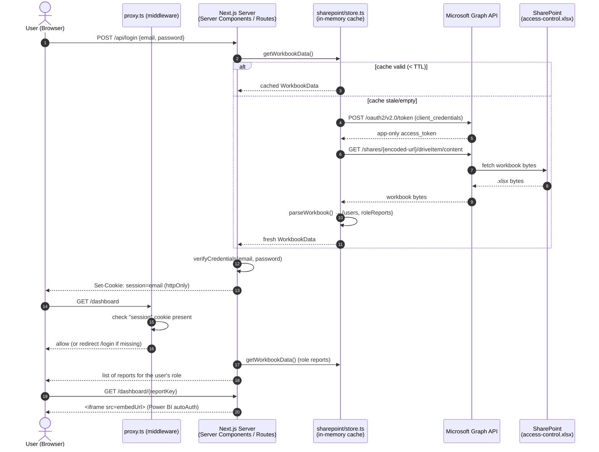

# SharePoint Excel Data Source — Architecture & Data Flow

**Date:** September 18, 2026
**Project:** Manomay Analytics

---

## 1. Summary

The application has no database and no local user/report configuration. **A single Excel workbook stored in SharePoint is the sole source of truth** for:

- Who can log in (email + password + role)
- Which Power BI reports each role can see, and their embed URLs

The app reaches that workbook through the **Microsoft Graph API**, using an app-only (client-credentials) Azure AD registration — no user ever has to sign in to SharePoint/Graph themselves. The workbook is downloaded, parsed into memory, and cached for a configurable TTL so the app isn't hitting Graph on every request.

This document describes how that fetch → parse → cache → authorize → render pipeline works end to end. For the earlier Power BI *embedding* decision (direct iframe vs. Service Principal token minting), see [2026-09-15 System Architecture](2026-09-15_system_architecture_and_powerbi_integration.md). For the rules to follow when *editing* the workbook itself, see [2026-09-18 Excel Workbook Maintenance Guide](2026-09-18_excel_workbook_maintenance_guide.md).

---

## 2. High-Level Sequence



---

## 3. Component Breakdown

```
┌──────────────────────────────────────────────────────────────────────────┐
│ CLIENT LAYER                                                             │
│  Browser                                                                 │
│   ├── src/app/login/page.tsx        (email/password form)               │
│   ├── src/app/dashboard/page.tsx    (report tiles, server component)    │
│   └── src/components/ReportViewer.tsx (iframe + fullscreen toggle)      │
└──────────────────────────────────┬────────────────────────────────────────┘
                                    │ Session cookie ("session" = email)
                                    ▼
┌──────────────────────────────────────────────────────────────────────────┐
│ APPLICATION SERVER LAYER (Next.js App Router)                           │
│   ├── src/proxy.ts                  Edge middleware — gates /dashboard/* │
│   │                                 on cookie presence only              │
│   ├── src/app/api/login/route.ts    Verifies credentials, sets cookie   │
│   ├── src/app/api/logout/route.ts   Clears cookie                       │
│   ├── src/lib/auth/session.ts       Reads the session cookie            │
│   ├── src/lib/auth/users.ts         verifyCredentials / getRoleForEmail │
│   └── src/lib/auth/access.ts        getReportsForEmail (RBAC lookup)    │
└──────────────────────────────────┬────────────────────────────────────────┘
                                    │ getWorkbookData()
                                    ▼
┌──────────────────────────────────────────────────────────────────────────┐
│ DATA SOURCE LAYER (src/lib/sharepoint/)                                 │
│   ├── store.ts        In-memory cache + TTL + stale-on-error fallback   │
│   ├── graphAuth.ts     App-only Graph token (client-credentials)        │
│   ├── graphFile.ts     Downloads the workbook via /shares/{id}/content  │
│   └── parseWorkbook.ts Parses Users sheet + one sheet per role          │
└──────────────────────────────────┬────────────────────────────────────────┘
                                    │ Graph API (HTTPS, app-only token)
                                    ▼
┌──────────────────────────────────────────────────────────────────────────┐
│ MICROSOFT 365                                                            │
│   ├── Azure AD app registration (AZURE_TENANT_ID/CLIENT_ID/SECRET)      │
│   └── SharePoint site: access-control.xlsx (Users sheet + role sheets) │
└──────────────────────────────────┬────────────────────────────────────────┘
                                    │ Report embed URLs (from role sheet)
                                    ▼
┌──────────────────────────────────────────────────────────────────────────┐
│ MICROSOFT POWER BI                                                       │
│   Direct organizational iframe embed, autoAuth=true                     │
│   (user's own Microsoft 365 session authenticates them)                 │
└──────────────────────────────────────────────────────────────────────────┘
```

---

## 4. Step-by-Step: How Data Actually Moves

### 4.1 Acquiring a Graph token — [`graphAuth.ts`](../src/lib/sharepoint/graphAuth.ts)

- Uses the **client-credentials** OAuth2 flow against `AZURE_TENANT_ID` / `AZURE_CLIENT_ID` / `AZURE_CLIENT_SECRET` with scope `https://graph.microsoft.com/.default`.
- This is an **app-only** token — it acts as the Azure AD app itself, not as any specific user. The app registration must be admin-consented for `Sites.Read.All` or `Files.Read.All` (or the ReadWrite variants) at the Graph application-permission level.
- The token is cached in a module-level variable and reused until ~60 seconds before it expires, so most requests don't re-authenticate at all.

### 4.2 Downloading the workbook — [`graphFile.ts`](../src/lib/sharepoint/graphFile.ts)

- Takes the workbook's SharePoint **"Copy link" share URL** (`SHAREPOINT_FILE_URL`) and base64url-encodes it into the `u!...` sharing-token format Graph's `/shares` endpoint expects.
- Calls `GET https://graph.microsoft.com/v1.0/shares/{shareId}/driveItem/content` with the app-only bearer token and downloads the raw `.xlsx` bytes.
- No local copy of the file is ever written to disk — it's held in memory as a `Buffer` and handed straight to the parser.

### 4.3 Parsing the workbook — [`parseWorkbook.ts`](../src/lib/sharepoint/parseWorkbook.ts)

Uses `exceljs` to read the buffer, then:

1. **`Users` sheet (required)** — every row after the header becomes a `{email, password, role}` record in a `Map` keyed by lowercased, trimmed email. Rows missing an email, password, or role are silently skipped. If the sheet is missing entirely, parsing throws (login/dashboard fail outright — see §5).
2. **Every other sheet** is treated as a **role sheet**, except `ReadMe` and `Users` (matched case-insensitively) which are explicitly excluded. The sheet's own name, lowercased and trimmed, *is* the role key. Each row after the header becomes a `{key, label, embedUrl}` report definition; rows missing a key or embed URL are skipped (this is how "placeholder" rows like `(no report access yet)` are ignored without special-casing them).
3. The result is one object: `{ users: Map<email, UserRecord>, roleReports: Record<role, ReportDefinition[]> }`.

This means **the code never hardcodes a role list or a user count** — both are fully derived from whatever rows/sheets exist in the workbook at parse time. Adding a sheet named `Manager` makes `manager` a valid role with zero code changes.

### 4.4 Caching — [`store.ts`](../src/lib/sharepoint/store.ts)

- `getWorkbookData()` is the only entry point the rest of the app calls.
- Serves the in-memory cache if it's younger than `SHAREPOINT_CACHE_TTL_SECONDS` (default **1800s / 30 minutes**).
- On expiry, refetches + reparses. Concurrent callers during a refresh share a single in-flight promise (no thundering herd against Graph).
- **If a refresh fails but a previous copy exists, the stale copy is served** and the error is logged — a transient SharePoint/Graph outage doesn't take login or the dashboard down. If there's no prior cache at all (e.g. cold start with SharePoint unreachable), the error propagates.

### 4.5 Authentication — [`api/login/route.ts`](../src/app/api/login/route.ts), [`auth/users.ts`](../src/lib/auth/users.ts)

- `verifyCredentials(email, password)` loads workbook data, looks up the email (case-insensitive), and compares the password **as plain text** against the `Password` column. There is no hashing — the workbook is the credential store as-is.
- On success, the server sets an `httpOnly`, `sameSite=lax` cookie named `session` whose **value is the user's email** (see [`session-constants.ts`](../src/lib/auth/session-constants.ts)), valid 8 hours. There is no server-side session store — the cookie *is* the session, and every subsequent request re-derives role/reports from the workbook by that email.
- If the workbook can't be fetched at all (Graph/SharePoint down, no stale cache), login returns `503` rather than silently allowing/denying access.

### 4.6 Route gating — [`proxy.ts`](../src/proxy.ts)

- Edge middleware matches `/dashboard/:path*` and only checks that the `session` cookie **is present** — it does not verify the email still exists in the workbook or that the role still has access. That deeper check happens in the page itself.

### 4.7 Authorization (RBAC) — [`auth/access.ts`](../src/lib/auth/access.ts)

- `getReportsForEmail(email)`: looks up the user's current role via `getRoleForEmail`, then returns `roleReports[role] || []` from the (possibly cached) workbook data.
- Because this re-reads the workbook (subject to cache TTL) on every dashboard request, **removing a user's role/reports in the sheet takes effect within one cache TTL window**, not instantly and not requiring a redeploy.
- If the role has no matching sheet, or the sheet has no valid rows, the user gets an empty list and is redirected to `/unauthorized`.

### 4.8 Rendering

- [`dashboard/page.tsx`](../src/app/dashboard/page.tsx): server component, calls `getReportsForEmail`, renders one tile per report (`report.label`, linking to `/dashboard/{report.key}`).
- [`dashboard/[reportKey]/page.tsx`](../src/app/dashboard/%5BreportKey%5D/page.tsx): re-fetches the same report list, finds the one matching the URL's `reportKey`, and 404s to `/unauthorized` if it's not in the user's current list (so a stale/guessed URL can't leak a report the user's role no longer has).
- [`ReportViewer.tsx`](../src/components/ReportViewer.tsx): a client component that renders the report's `embedUrl` inside a plain `<iframe>` with a full-screen toggle. Power BI's own `autoAuth=true` organizational embedding handles authenticating the *viewer's* Microsoft 365 identity — the app never brokers a Power BI token itself (see the 2026-09-15 doc for why).

---

## 5. Environment Variables Reference

From [`.env.example`](../.env.example):

| Variable | Purpose |
| :-- | :-- |
| `AZURE_TENANT_ID` / `AZURE_CLIENT_ID` / `AZURE_CLIENT_SECRET` | App-only Azure AD registration used for Graph client-credentials auth. Needs `Sites.Read.All` or `Files.Read.All` (app permission, admin-consented). |
| `SHAREPOINT_FILE_URL` | The workbook's SharePoint "Copy link" share URL. |
| `SHAREPOINT_CACHE_TTL_SECONDS` | How long parsed workbook data is cached before refetching. Default `1800`. |
| `NEXT_PUBLIC_COMPANY_NAME` | Cosmetic branding only. |

There is intentionally **no env-var fallback** for users or reports — if `SHAREPOINT_FILE_URL` is missing/unreachable and there's no warm cache, login and the dashboard fail outright rather than serving stale/local data silently.

---

## 6. Known Characteristics & Failure Modes

- **Passwords are plain text** in both the sheet and the comparison logic — there is no hashing/salting layer today. Treat the workbook's access as equivalent to holding all user passwords.
- **No per-request Graph validation of the logged-in user.** The session cookie is trusted for 8 hours; a user removed from the `Users` sheet keeps their cookie valid until it expires or they log out, though `getReportsForEmail` will start returning `[]` for them once the cache refreshes (role lookup fails → no reports → `/unauthorized`).
- **Cache TTL is a single global value** — there's no per-sheet or per-user invalidation; every write to the workbook waits out the same window everywhere.
- **Report keys are used unencoded in route paths** (`/dashboard/{report.key}`) — see the maintenance guide for why `Report Key` values must stay URL-safe.
- **Duplicate emails in the `Users` sheet**: since parsing builds a `Map` keyed by email, the *last* matching row wins silently — no error is raised for duplicates.

---

## 7. Related Documents

- [2026-09-15 System Architecture & Power BI Integration](2026-09-15_system_architecture_and_powerbi_integration.md) — why report embedding is a direct iframe rather than Service-Principal token minting.
- [2026-09-18 Excel Workbook Maintenance Guide](2026-09-18_excel_workbook_maintenance_guide.md) — field-by-field rules for editing the workbook safely.
