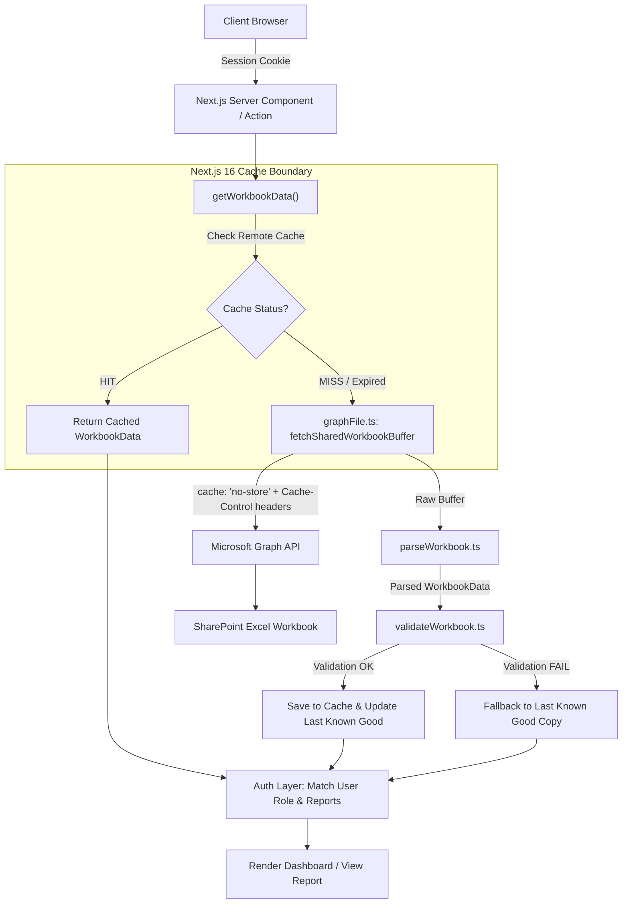

# Manomay Analytics — Caching Architecture Documentation

This document describes the caching mechanism for **Manomay Analytics**. The application uses **Next.js 16 Cache Components** (`cacheComponents: true`) to provide a high-performance, resilient, and shared remote caching layer for access-control data retrieved from Microsoft SharePoint.

---

## 1. Executive Summary & Core Principles

1. **Source of Truth**: An Excel workbook hosted on Microsoft SharePoint/OneDrive containing user accounts and role-to-report permission matrices.
2. **Single Cache Boundary**: All workbook downloads and parsing are centralized inside [`getWorkbookData()`](/manomay-analytics/src/lib/sharepoint/store.ts#L25) decorated with `"use cache: remote"`.
3. **Decoupled Security**: Workbook data is cached globally across all users and server instances, but authorization decisions (`User -> Role -> Allowed Reports`) remain request-specific based on active session cookies.
4. **Last Known Good (LKG) Resilience**: If a refresh fails or Microsoft Graph API is unreachable, the system serves the last valid cached copy rather than breaking login and dashboard access.

---

## 2. System Architecture Diagram



---

## 3. Cache Lifecycles & Configuration

The cache behavior is defined in [`next.config.ts`](/manomay-analytics/next.config.ts#L5) under the `sharepointWorkbook` profile:

```ts
// next.config.ts
const nextConfig: NextConfig = {
  cacheComponents: true,
  cacheLife: {
    sharepointWorkbook: {
      stale: 60,       // 1 minute client freshness window
      revalidate: 300, // 5 minutes background server revalidation window
      expire: 1800,    // 30 minutes hard expiration window
    },
  },
};
```

### Cache Window Breakdown

| Phase | Duration | Behavior |
| :--- | :--- | :--- |
| **Fresh** | `0s – 60s` | Requests return cached data instantly without revalidating. |
| **Stale-While-Revalidate** | `60s – 300s` | Requests serve existing cached data while Next.js triggers a background re-fetch from SharePoint. |
| **Server Revalidation** | `300s – 1800s` | Server actively checks and updates the cached entry on demand. |
| **Hard Expiry** | `> 1800s (30m)` | Hard expiration forces incoming requests to await a fresh download and validation cycle. |

---

## 4. Invalidation & On-Demand Refresh

### Cache Tag
All workbook cache entries are tagged with **`sharepoint-workbook`** via `cacheTag('sharepoint-workbook')`.

### Refresh Triggers
1. **Server Action (`refreshWorkbookCache`)**: Located in [`src/app/actions/workbook.ts`](/manomay-analytics/src/app/actions/workbook.ts#L6). Executed when a user clicks **"Refresh Excel Data Cache"** on the Login Page.
2. **API Route Handler (`POST /api/revalidate`)**: Located in [`src/app/api/revalidate/route.ts`](/manomay-analytics/src/app/api/revalidate/route.ts#L8). Allows programmatic or webhook-driven cache invalidation.

```ts
// src/app/actions/workbook.ts
'use server';

import { updateTag } from 'next/cache';
import { WORKBOOK_CACHE_TAG, getWorkbookData } from '@/lib/sharepoint/store';

export async function refreshWorkbookCache() {
  updateTag(WORKBOOK_CACHE_TAG);
  const data = await getWorkbookData();
  return {
    ok: true,
    userCount: data.users.size,
    rolesCount: Object.keys(data.roleReports).length,
    refreshedAt: new Date().toISOString(),
  };
}
```

---

## 5. Validation & Fault Tolerance Layer

Before any fetched dataset is written to cache storage, [`validateWorkbook`](/manomay-analytics/src/lib/sharepoint/validateWorkbook.ts#L3) performs strict structural validation:

1. **User Count Verification**: Ensures `data.users` is a non-empty `Map`.
2. **Role Mapping Verification**: Ensures `data.roleReports` contains at least one mapped role.
3. **Last Known Good (LKG) Protection**: If Microsoft Graph API returns HTTP errors or the downloaded file fails parsing/validation, [`store.ts`](/manomay-analytics/src/lib/sharepoint/store.ts#L20) catches the failure and serves `lastKnownGood`, ensuring zero downtime for end users.

---

## 6. File Structure & Component Map

- [`next.config.ts`](/manomay-analytics/next.config.ts): Configures `cacheComponents: true` and `sharepointWorkbook` cacheLife profile.
- [`src/lib/sharepoint/graphFile.ts`](/manomay-analytics/src/lib/sharepoint/graphFile.ts): Downloads raw Excel buffer from Microsoft Graph API with `cache: 'no-store'` and `Cache-Control: no-cache` headers.
- [`src/lib/sharepoint/parseWorkbook.ts`](/manomay-analytics/src/lib/sharepoint/parseWorkbook.ts): Parses Excel worksheets using `exceljs`.
- [`src/lib/sharepoint/validateWorkbook.ts`](/manomay-analytics/src/lib/sharepoint/validateWorkbook.ts): Pre-cache integrity validator.
- [`src/lib/sharepoint/store.ts`](/manomay-analytics/src/lib/sharepoint/store.ts): Next.js 16 `"use cache: remote"` boundary.
- [`src/app/actions/workbook.ts`](/manomay-analytics/src/app/actions/workbook.ts): Server Action for tag-level cache invalidation.
- [`src/app/api/revalidate/route.ts`](/manomay-analytics/src/app/api/revalidate/route.ts): Revalidation API route.
- [`src/app/login/page.tsx`](/manomay-analytics/src/app/login/page.tsx): UI trigger for manual cache revalidation.
